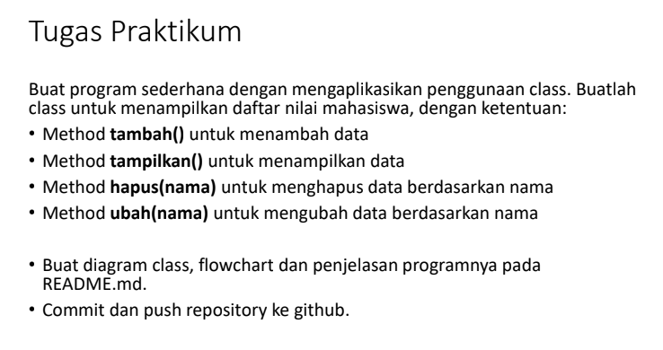
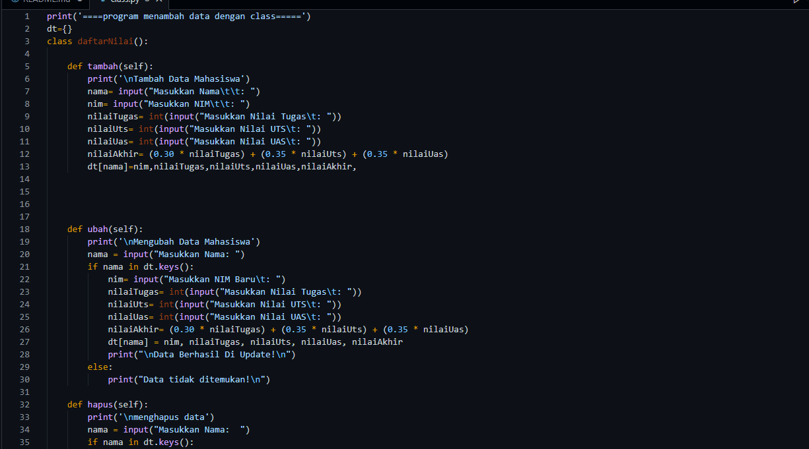
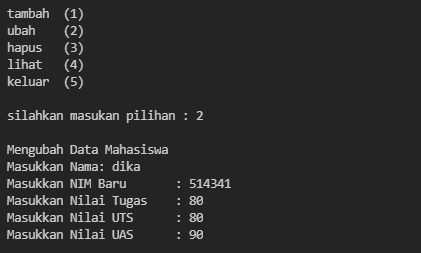
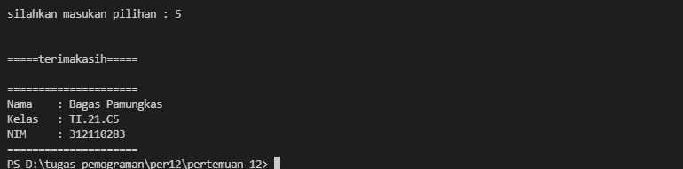

# pertemuan-12
pada pertemuan 12 saya diberi soal :

# diagram class

# flowchart

# program

pertama saya membuat sebuah class daftar nilai

        class daftarNilai()

Lalu saya melanjutkan dengan membuat method method fungsinya

            def tambah(self)
        def ubah(self)
        def lihat(self)
        def hapus(self)

lalu saya mengisi setiap method dengan elemen elemen nya

            nama= input("masukan nama: ")
        nim= input("masukan nim :")                                         
        nilaiTugas= int(input("Masukkan Nilai Tugas: "))
        nilaiUts= int(input("Masukkan Nilai UTS\t: "))            
        nilaiUas= int(input("Masukkan Nilai UAS\t: "))             
        nilaiAkhir= (0.30 * nilaiTugas) + (0.35 * nilaiUts) + (0.35 * nilaiUas)
        dt[nama]=nim,nilaiTugas,nilaiUts,nilaiUas,nilaiAkhir

lalu saya membuat sebuah looping

        while True:
        input('tambah   (1)
            ubah     (2)
            lihat    (3)
            hapus    (4)
            ')
            c = input("\nsilahkan masukan pilihan : ")

  dan terakhir membuat fungsi if else untuk menjalankan method

            if (c=="1"):
            data.tambah()
        elif (c=="2"):
            data.ubah()
        elif (c=="3"):
            data.lihat()
        elif (c=="4"):
            data.hapus()
        else:
            data.keluar()
            break         

# tampilan visual studio code

# output program

ini adalah output apabila memilih tambah(1)

ini adalah output apabila memilih ubah(2)

ini adalah output apabila memilih untuk tambah lagi

ini adalah output apabila memilih hapus(3)

ini adalah output apabila memilih lihat (4)

ni adalah output apabila memilih else

        ======TERIMAKASIH======

